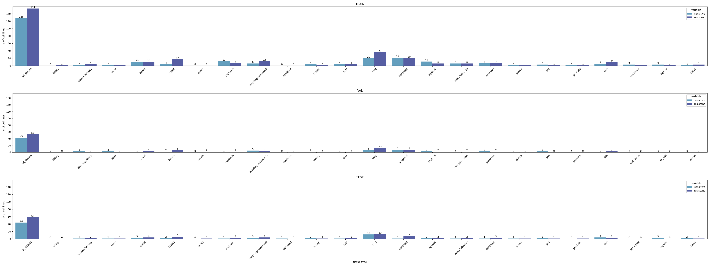
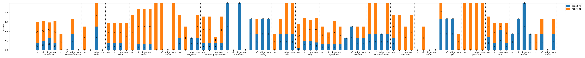
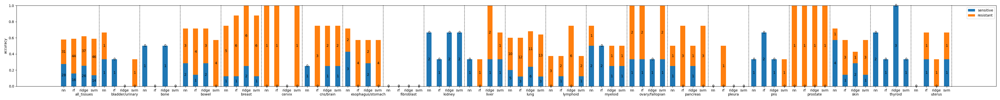
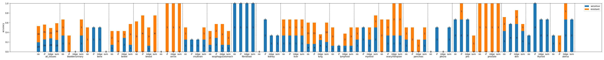
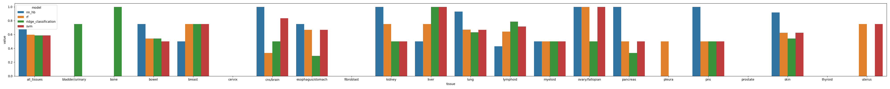
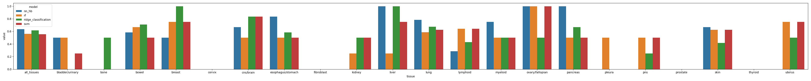
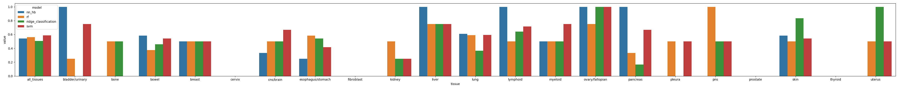

# Report

## Data Distribution

## Evaluation - Accuracy (cdk4_6_genes)

## Evaluation - Accuracy (cdk4_6_cancer)

## Evaluation - Accuracy (pearson)

## Evaluation - ROCAUC (cdk4_6_genes)
### (for tissues that contain both classes                         in the testing dataset)

## Evaluation - ROCAUC (cdk4_6_cancer)
### (for tissues that contain both classes                         in the testing dataset)

## Evaluation - ROCAUC (pearson)
### (for tissues that contain both classes                         in the testing dataset)

