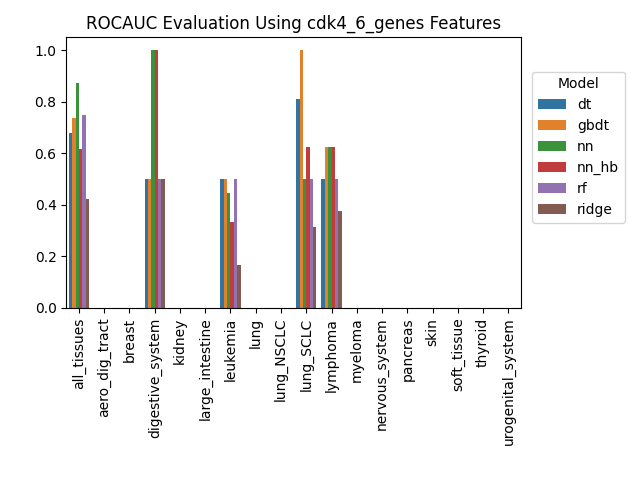

# Final Report

legend: 0 = sensitive, 1 = resistant

## Decision Tree

## Gradient-Boosted Decision Tree

## Neural Net

## Neural Net with Hyperband Tuning

## Random Forest

## Ridge Classifier

