# Final Report

legend: 0 = sensitive, 1 = resistant

## Decision Tree
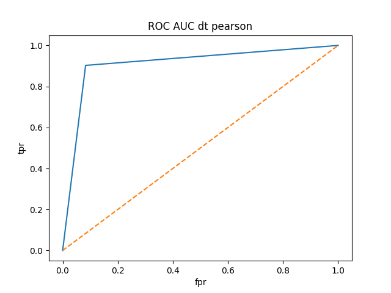
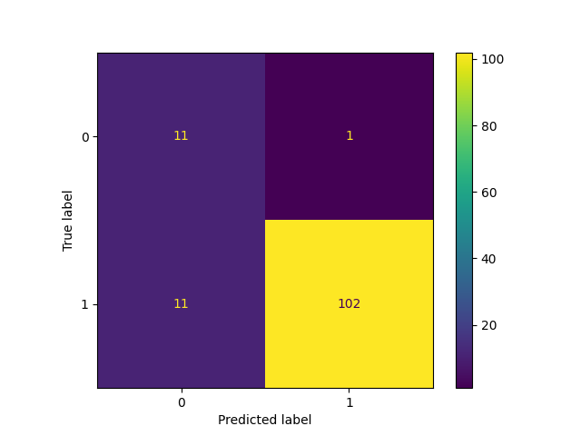

## Gradient-Boosted Decision Tree
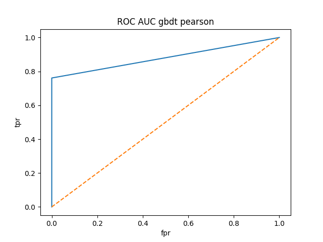
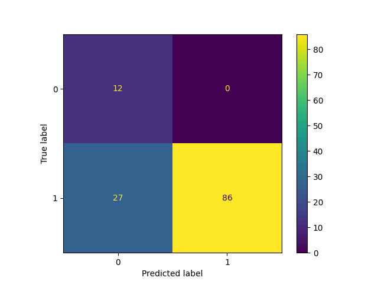

## Neural Net
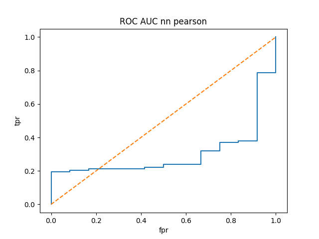
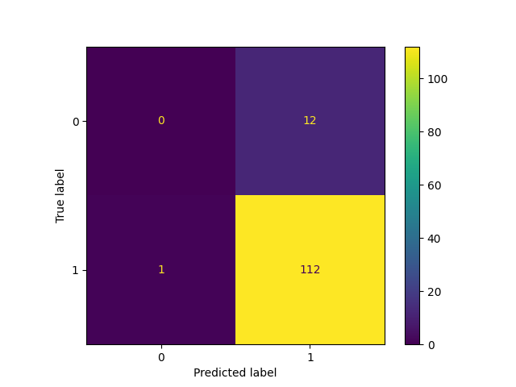

## Neural Net with Hyperband Tuning
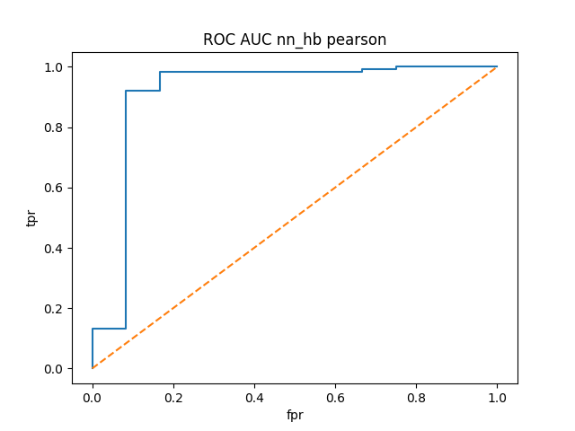

## Random Forest
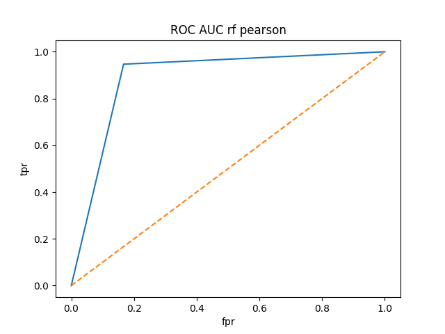
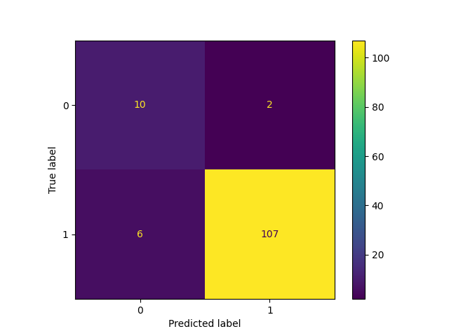

## Ridge Classifier
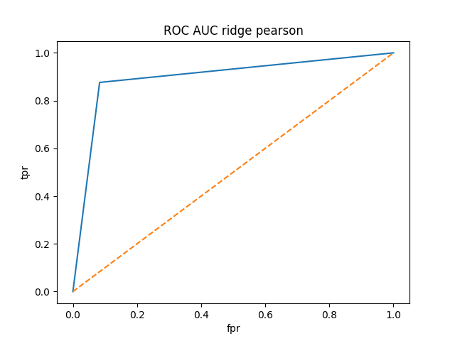
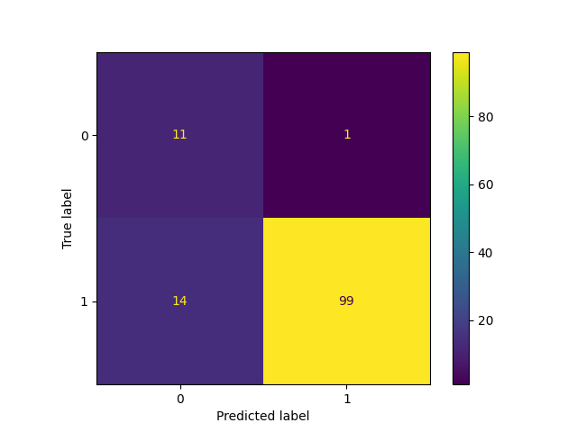
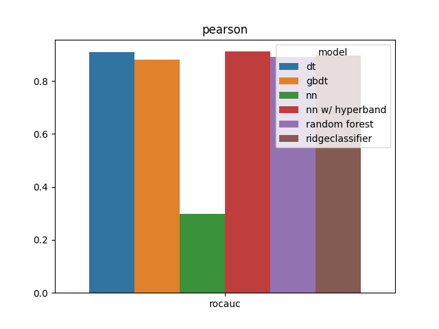
